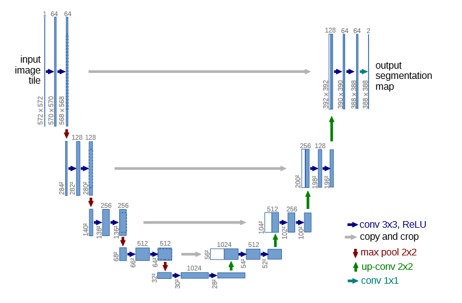
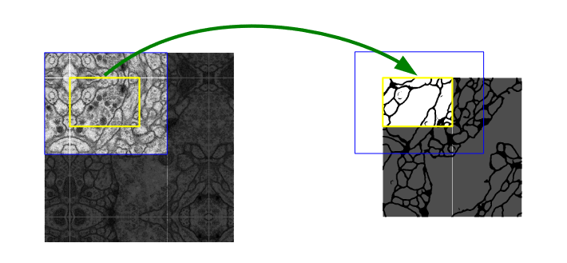

# Segmentation with U-Net

> Reproduction of the U-Net model. 
>
> U-Net: Convolutional Networks for Biomedical Image Segmentation (2015)
> Olaf Ronneberger, Philipp Fischer, Thomas Brox
> https://arxiv.org/abs/1505.04597

## Background

The U-Net architecture was first introduced for pixel segmentation of biomedical images to overcome the limitations of deep segmentation models at the time, which included long training times and a need for a large dataset. 

The U-Net is composed of an encoder (the left half of the 'U') and a decoder (the right half of the 'U') with skip connections forwarding features from the encoder to decoder at varying levels. Such skip connections allow for the recovery of finer details that may have been lost in deeper layers. This network distinguishes itself from previous studies by forgoing fully connected layers, and instead employing convolutional layers. The 2D convolutional layers make localization and contextualization possible, and the final output yields a pixel-by-pixel segmentation map of the input image. 



The paper uses an overlap-tile strategy that accounts for seamless segmentation of images of any size, if they need to be cut into patches first. This creates an asymmetrical encoder and decoder, which results in the output map being a smaller size than the input. In the figure below, the blue box contains the area of inputted image, and the yellow box denotes the size of the segmentation map. Boundary pixels are accounted for by padding the image via a mirroring extrapolation. 



The U-Net architecture was a breakthrough for deep segmentation tasks, and set off research in many other variations, such as the Attention U-Net and DeepUNet. 

## Running the training and testing scripts

```python
# train
python main.py train

# test
python main.py test

# both train and test
python main.py traintest
```

- Adjustable parameters are stored in options.yaml.

## Environment
- Tested on Python 3.7 / Torch 1.9

## Custom Dataset
- Under the root directory, split images and their labels under train/val/test folders as follows: 

```
- datasets
    - train
        - imgs
        - lbls
    - val
        ...
    - test 
        ...
```

- Label names should be the same as the image names. 